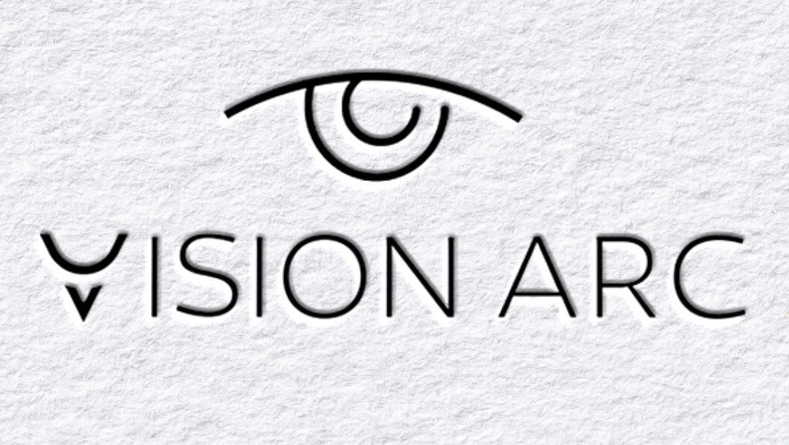

 

  

###

<h1 align="center"><picture>
  <source srcset="https://fonts.gstatic.com/s/e/notoemoji/latest/1f64c_1f3fb/512.webp" type="image/webp">
  
</picture>Hi, I'm Reza Mahmoodi</h1> 

###

<h5 align="center">Fornt-end Developer</h5>

###

  
  
  

> {
> - 👨‍💻 Frontend Developer with a passion for clean and modern web development.
> 
> - 🎓 Computer engineering student with a strong interest in tech and innovation.
> - 🧑‍🏫 Former programming instructor with experience in teaching beginners.
> 
> - 💻 Currently specializing in frontend technologies like Vue.js, Nuxt.js, and Tailwind CSS.
> - 🧠 Team Lead and Manager at VisionArc — working on expanding and growing our team.
> - ❤️ Big fan of cars, motorcycles, and my birds. They keep me inspired and curious!
>  
> }

###

  

###

<h3 align="center"><picture>
  <source srcset="https://fonts.gstatic.com/s/e/notoemoji/latest/1f447_1f3fb/512.webp" type="image/webp">
  
</picture> Language and tools <picture>
  <source srcset="https://fonts.gstatic.com/s/e/notoemoji/latest/1f447_1f3fb/512.webp" type="image/webp">
  
</picture></h3>

###

  
  
  
  
  
  
  
  
  
  
  
  
  
  
  
  
  
  
  
  
  

###

  
  
  
  
  
  
  

###

  

###
